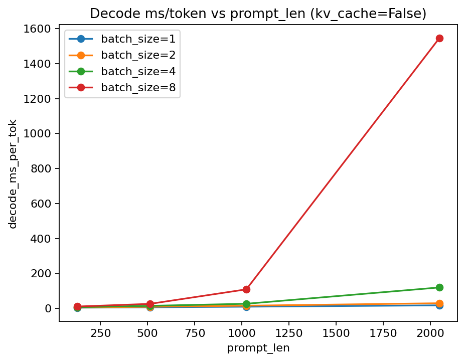
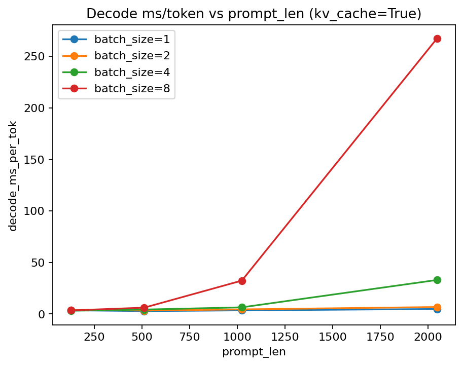
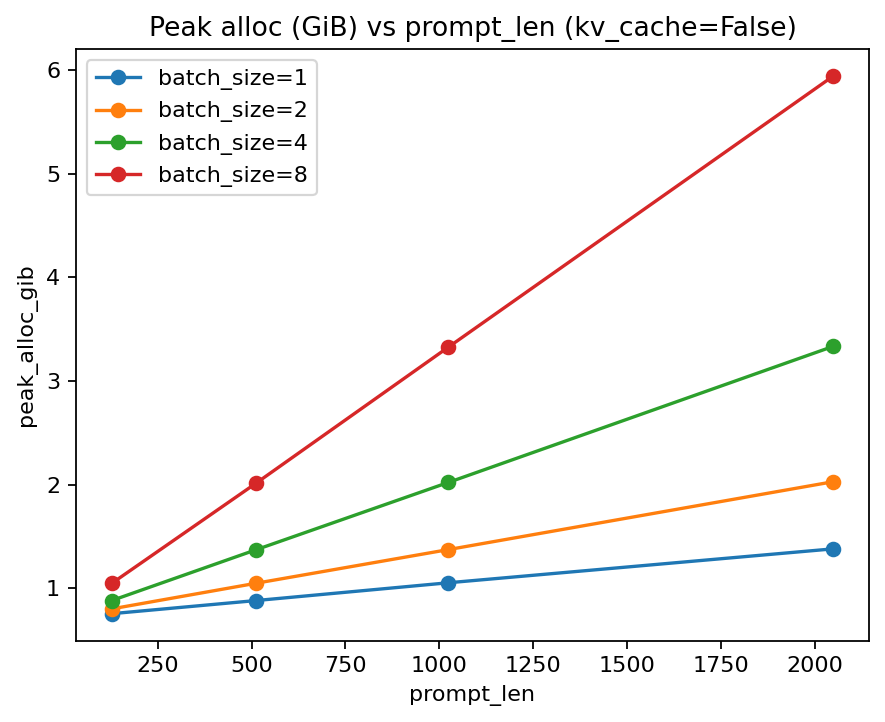
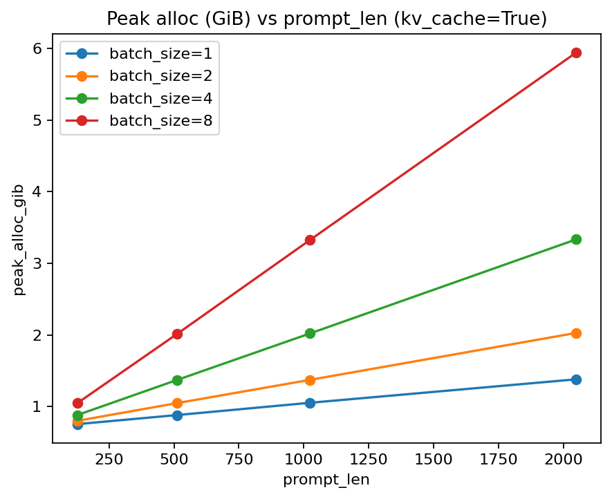

# nanoGPT Inference Benchmarking (KV Cache Focus)

This repository is a **deliberate fork of nanoGPT** designed for one purpose only:

> **To benchmark and explain LLM inference behavior on GPUs, with and without KV cache.**

This is **not** a training repo and **not** a production serving stack.
It is a controlled experimental harness for understanding:
- prefill vs decode costs
- KV cache impact on latency and memory
- batch size and prompt length scaling
- GPU memory behavior during inference


---

## What Changed vs Original nanoGPT

Baseline reference:
https://github.com/karpathy/nanoGPT

### Modified / New Files

| File | Purpose |
|-----|--------|
| `model.py` | Adds KV cache support, offset causal masking, and cache-aware forward path |
| `batch_infer.py` | Single-run inference benchmark (prefill + decode-only) |
| `run_sweep.py` | Grid sweep driver that aggregates JSON → CSV → plots |
| `bench_out/` | All benchmark artifacts (JSON, CSV, PNG) |


---

## Benchmark Methodology

Each benchmark run follows this exact sequence:

1. Build or load a fixed prefix (`prompt_len`)
2. Warm up GPU kernels
3. Measure **prefill**
4. Measure **decode-only**
5. Record GPU memory statistics
6. Persist results to JSON

Important properties:
- Prefill and decode are timed **separately**
- Decode metrics are reported **per token**
- KV cache on/off is the only semantic change between runs


---

## bf16 Benchmark Artifacts

All plots and CSVs below are generated from:

```text
bench_out/bf16/
```

These results were collected using **bfloat16**, identical model config,
and identical prefixes across KV modes.


---

## Decode Latency (ms / token)

### KV Cache = False
- Plot:  
  `bench_out/bf16/plot_decode_ms_per_tok_kv_False.png`
    
- [Raw data](bench_out/bf16/sweep_kv_False.csv):  
  `bench_out/bf16/sweep_kv_False.csv`

Observations:
- Decode cost grows rapidly with prompt length
- Large batch sizes amplify attention recomputation cost
- Severe latency cliff at `(batch_size=8, prompt_len=2048)`


### KV Cache = True
- Plot:  
  `bench_out/bf16/plot_decode_ms_per_tok_kv_True.png`
  
- [Raw data](bench_out/bf16/sweep_kv_True.csv):  
  `bench_out/bf16/sweep_kv_True.csv`

Observations:
- Decode latency is dramatically reduced vs no-KV
- Growth with prompt length is much slower
- Batch size still matters, but no longer catastrophically


---

## Peak GPU Memory (GiB)

### KV Cache = False
- Plot:  
  `bench_out/bf16/plot_peak_alloc_gib_kv_False.png`
  
### KV Cache = True
- Plot:  
  `bench_out/bf16/plot_peak_alloc_gib_kv_True.png`
  

Observations:
- Peak memory scales linearly with `(batch_size × prompt_len)`
- KV cache **does not reduce peak memory** during prefill
- KV cache shifts cost from compute to memory during decode


---

## Key Takeaways

- KV cache primarily optimizes **decode**, not prefill
- Batching helps GPU utilization but magnifies memory pressure
- Long context + large batch sizes trigger hard GPU cliffs
- “KV cache makes inference cheap” is false without qualification


---

## How to Reproduce (PowerShell)

```powershell
python run_sweep.py `
  --out_dir=bench_out/bf16 `
  --dtype=bfloat16 `
  --prefix_source=random `
  --kv_modes=False,True `
  --prompt_lens=128,512,1024,2048 `
  --batch_sizes=1,2,4,8 `
  --max_new_tokens=128 `
  --warmup_iters=1 `
  --bench_iters=3
```

This produces:
- `infer_*.json` (per experiment)
- `sweep_kv_*.csv` (aggregated)
- `plot_*.png` (visualizations)


