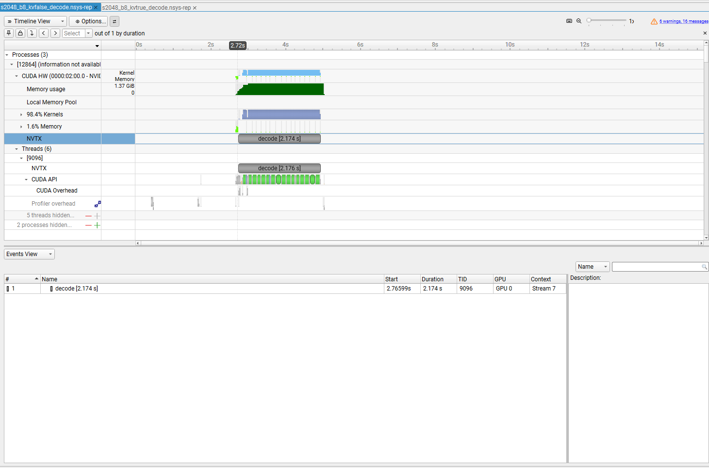
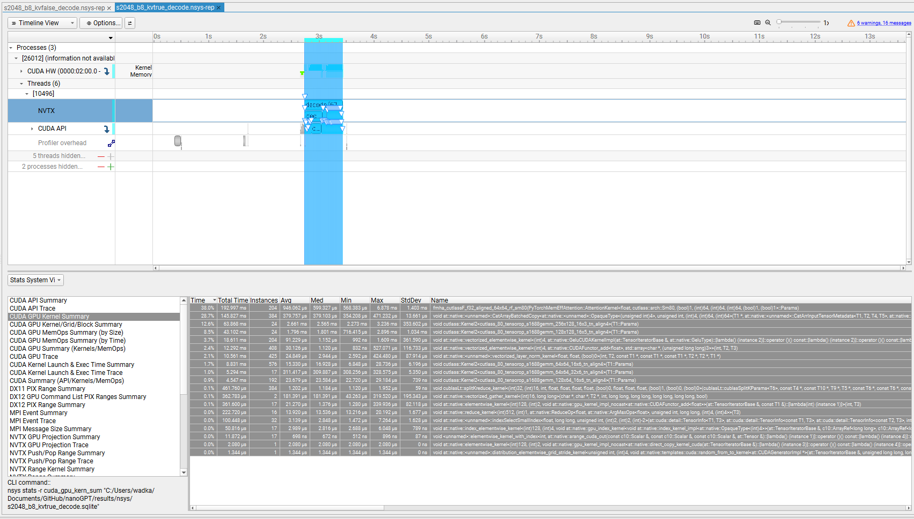
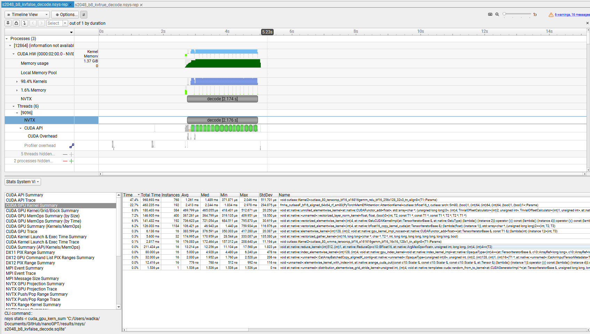
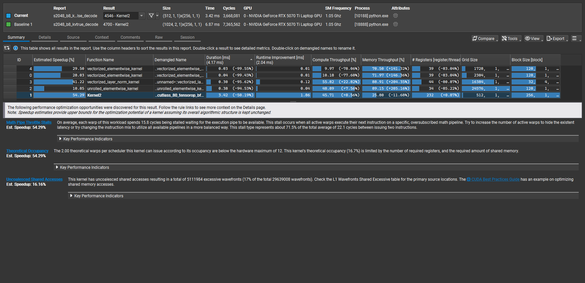
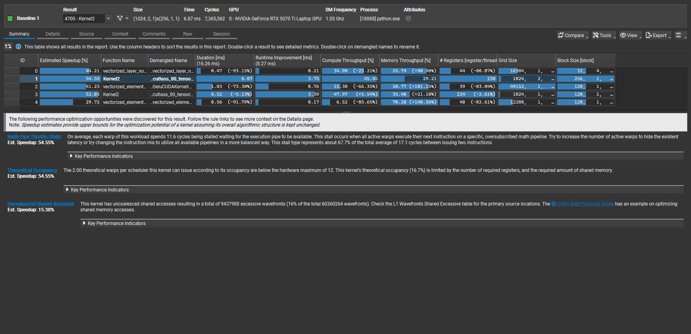

# KV Cache Decode Comparison using Nsight
T=2048, B=8, Decode Phase (16 tokens for Nsight Systems)
RTX 5070 Ti Laptop GPU, bf16, PyTorch 2.9

---

## Summary

KV caching does not make kernels faster.

KV caching reduces the amount of work performed during decode.

The speedup comes from fewer attention computations, not from better kernel efficiency.

| Mode | Decode Total (ms) | ms per token | tokens per second |
|---|---:|---:|---:|
| KV = false | 2176.7 | 136.0 | 7.35 |
| KV = true | 676.1 | 42.3 | 23.66 |

Benchmark sources:
- [KV=false decode JSON](../results/infer_T2048_B8_KVfalse_Pdecode.json)
- [KV=true decode JSON](../results/infer_T2048_B8_KVtrue_Pdecode.json)

Artifacts:
- [KV=false NSYS](../results/s2048_b8_kvfalse_decode.nsys-rep.png)
- [KV=true NSYS](../results/s2048_b8_kvtrue_decode.nsys-rep.png)
- [KV=false NCU](../results/s2048_b8_kvfalse_decode.ncu-rep.png)
- [KV=true NCU](../results/s2048_b8_kvtrue_decode.ncu-rep.png)
- [KV=false NSYS Kernel Summary](../results/s2048_b8_kvfalse_decode.kernel_summary.nsys-rep.png)
- [KV=true NSYS Kernel Summary](../results/s2048_b8_kvtrue_decode.kernel_summary.nsys-rep.png)

---

## Important Scope Note (NSYS vs NCU)

The Nsight Systems runs generated **16 tokens**. These traces capture the full decode loop and kernel instance counts.

The Nsight Compute runs generated **1 token**. These captures isolate kernel behavior for a single decode step.

This means:
- NSYS is the source of truth for "how many times did this kernel run"
- NCU is the source of truth for "what did this one kernel do per launch"

Do not mix instance counts from NSYS with per-launch durations from NCU without normalizing for `max_new_tokens`.

---

## What Changes When KV Cache Is Enabled

### KV = false

- Attention is recomputed for every decode token
- QKᵀ scales with prompt length
- Many attention operations that touch the full prompt history
- Repeated reads of keys and values
- Memory traffic scales with T

### KV = true

- Keys and values are cached
- Attention is computed only for the new token against cached K,V
- Work scales with number of generated tokens, not with prompt length
- Total memory traffic is reduced across the whole decode loop

The algorithmic structure changes. Kernel quality does not.

---

## Nsight Systems Analysis (16 tokens)

### KV = false



- Single decode region of approximately 2.17 seconds
- Dense sequence of kernel launches
- No clear per-token separation
- GPU repeatedly executes full attention work each token

All decode work is contained inside one long region.

---

### KV = true


Distinct phases are visible.

- One `decode_kv_prefill` region of approximately 318 ms
- Multiple `decode_kv_step` regions
- Each decode step is approximately 18 ms

Accounting check:

- 16 decode steps at ~18 ms is ~288 ms
- Prefill is ~318 ms
- Combined is ~606 ms plus overhead
- Measured total is ~676 ms

The timeline matches the benchmark numbers.

---

## Nsight Systems Kernel Summary (16 tokens)

These tables answer the question that Nsight Compute cannot: which kernels dominate total time and how many times they run.

### KV = true kernel mix



What it says:

- `fmha_cutlassF_*` shows up with **204 instances** and is the largest single time bucket.
- Multiple `cutlass::Kernel2<...gemm...>` kernels show up with **24 instances** each.
- LayerNorm, GELU, and add kernels are frequent, but most are not the primary time sink.

This is the important point:

The KV=true run is dominated by fewer attention-related kernels per token and a stable per-step pattern.

---

### KV = false kernel mix



What it says:

- A BF16 CUTLASS GEMM kernel is dominant with **768 instances**.
- `fmha_cutlassF_*` shows up with **192 instances**.
- There is more auxiliary traffic: copies, adds, GELU, layernorm show larger totals because the whole attention path is repeated per token.

This is the important point:

KV=false is not "one slow kernel". It is a lot of repeated work, expressed as many more kernel instances.

---

## Nsight Compute Scope (1 token)

Nsight Compute is used to inspect individual kernels.

It does not explain end-to-end latency.

It explains why a specific kernel behaves the way it does for a single launch.

The comparison below focuses on the dominant CUTLASS GEMM kernel surfaced in the NCU report view.

---

## Dominant GEMM Comparison (1 token)

### KV = false



| Metric | Value |
|---|---:|
| Kernel duration | 3.42 ms |
| Grid size | (512, 1) |
| Block size | (256, 1) |
| Registers per thread | 232 |
| Compute throughput | 45.7% |
| Memory throughput | 25.8% |
| Theoretical occupancy | 16.7% |
| Math pipeline stall | 71.5% |

This kernel is smaller per launch.

In the full NSYS run it launches many more times because the attention path is re-executed for each token.

---

### KV = true



| Metric | Value |
|---|---:|
| Kernel duration | 6.52 ms |
| Grid size | (1024, 1) |
| Block size | (128, 1) |
| Registers per thread | 224 |
| Compute throughput | 48.0% |
| Memory throughput | 35.4% |
| Theoretical occupancy | 8.3% |
| Limiting factor | Shared memory |

This kernel is larger and heavier per launch.

That does not contradict the overall speedup because the decode loop executes less total attention work.

---

## Interpretation

The KV=true kernel is slower per launch.

This is expected.

Reasons (as suggested by NCU metrics):
- Larger work per block
- Higher shared memory pressure
- Lower theoretical occupancy
- More synchronization
- Fewer active warps available to hide latency

Nsight Compute is describing kernel mechanics. It is not making a statement about end-to-end decode time.

---

## Why KV Cache Is Still Faster

The performance gain comes from reducing the amount of attention recomputation across decode tokens.

At a high level:

- KV=false re-runs the attention path in a way that repeatedly touches the full prompt history.
- KV=true reuses cached K,V and computes attention for the new token against the cached state.

So even if a KV=true kernel launch costs more, the total number of launches and total attention work is lower.

The speedup is algorithmic.

---

## Key Takeaways

- KV caching does not improve kernel efficiency
- KV caching reduces algorithmic complexity during decode
- NSYS explains where the time goes in the full loop
- NCU explains why a specific kernel behaves the way it does
- Interpret kernel metrics only within the profiling scope

The observed speedup is due to reduced attention recomputation, not faster kernels.

---

## Reproducing the Profiles

The following commands were used to collect the traces shown above.

NCU commands were run with `max_new_tokens=1` to isolate a single decode step.

NSYS commands were run with `max_new_tokens=16` to capture the full decode loop and instance counts.

### Nsight Systems

KV = false:

```powershell
& "C:\Program Files\NVIDIA Corporation\Nsight Systems 2025.6.1\target-windows-x64\nsys.exe" profile `
  --force-overwrite=true `
  --output C:\Users\wadka\Documents\GitHub\nanoGPT\results\nsys\s2048_b8_kvfalse_decode `
  --trace=cuda,nvtx,wddm `
  --cuda-memory-usage=true `
  python batch_infer.py `
    --phase=decode `
    --cache_prefix=False `
    --prefix_source=random `
    --dtype=bfloat16 `
    --prompt_len=2048 `
    --batch_size=8 `
    --max_new_tokens=16 `
    --kv_cache=False `
    --warmup_iters=0 `
    --bench_iters=1
```

KV = true:

```powershell
& "C:\Program Files\NVIDIA Corporation\Nsight Systems 2025.6.1\target-windows-x64\nsys.exe" profile `
  --force-overwrite=true `
  --output C:\Users\wadka\Documents\GitHub\nanoGPT\results\nsys\s2048_b8_kvtrue_decode `
  --trace=cuda,nvtx,wddm `
  --cuda-memory-usage=true `
  python batch_infer.py `
    --phase=decode `
    --cache_prefix=False `
    --prefix_source=random `
    --dtype=bfloat16 `
    --prompt_len=2048 `
    --batch_size=8 `
    --max_new_tokens=16 `
    --kv_cache=True `
    --warmup_iters=0 `
    --bench_iters=1
```

### Nsight Compute

KV = false:

```powershell
& "C:/Program Files/NVIDIA Corporation/Nsight Compute 2025.2.1/target/windows-desktop-win7-x64/ncu.exe" `
  --set full `
  --target-processes all `
  --replay-mode kernel `
  --launch-skip 50 `
  --launch-count 5 `
  --export C:/Users/wadka/Documents/GitHub/nanoGPT/results/ncu/s2048_b8_kvfalse_decode `
  --force-overwrite `
  python batch_infer.py `
    --phase=decode `
    --cache_prefix=False `
    --prefix_source=random `
    --dtype=bfloat16 `
    --prompt_len=2048 `
    --batch_size=8 `
    --max_new_tokens=1 `
    --kv_cache=False `
    --warmup_iters=0 `
    --bench_iters=1
```

KV = true:

```powershell
& "C:/Program Files/NVIDIA Corporation/Nsight Compute 2025.2.1/target/windows-desktop-win7-x64/ncu.exe" `
  --set full `
  --target-processes all `
  --replay-mode kernel `
  --launch-skip 50 `
  --launch-count 5 `
  --export C:/Users/wadka/Documents/GitHub/nanoGPT/results/ncu/s2048_b8_kvtrue_decode `
  --force-overwrite `
  python batch_infer.py `
    --phase=decode `
    --cache_prefix=False `
    --prefix_source=random `
    --dtype=bfloat16 `
    --prompt_len=2048 `
    --batch_size=8 `
    --max_new_tokens=1 `
    --kv_cache=True `
    --warmup_iters=0 `
    --bench_iters=1
```
