# GQA vs MQA vs MHA: Decode Performance, Memory, and Accuracy Tradeoffs

This document summarizes a controlled experimental study comparing **Multi-Head Attention (MHA)**,
**Grouped-Query Attention (GQA)**, and **Multi-Query Attention (MQA)** in nanoGPT.

All experiments were run with identical model size, training setup, dataset, and evaluation protocol.
Only the number of KV heads (`n_kv_head`) was varied.

The goal is to understand the **full systems tradeoff**:
- Decode latency
- GPU memory consumption (KV cache)
- Model quality (validation loss and perplexity)

---

## 1. Decode Latency vs Prompt Length

These plots show **decode latency per generated token** as a function of prompt length, for different batch sizes.

### Batch = 1
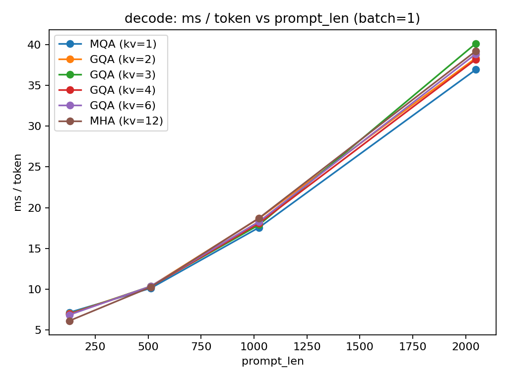

### Batch = 4
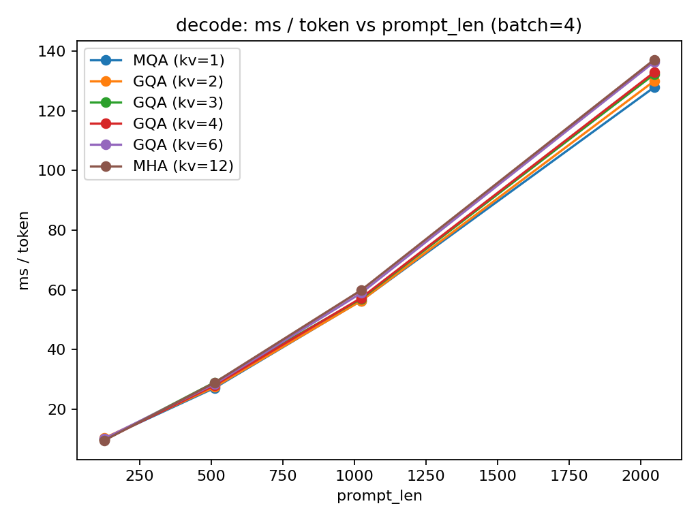

### Batch = 8

### Batch = 16
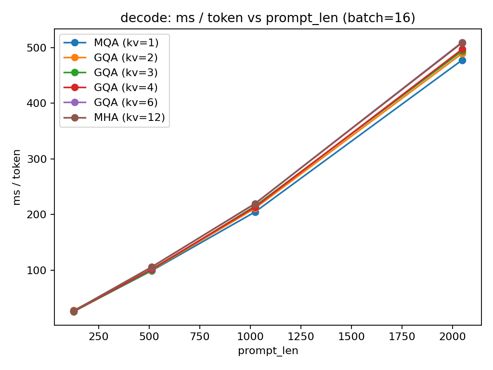

### Batch = 32

---

## 2. Decode Latency vs Batch Size

### Prompt Length = 128
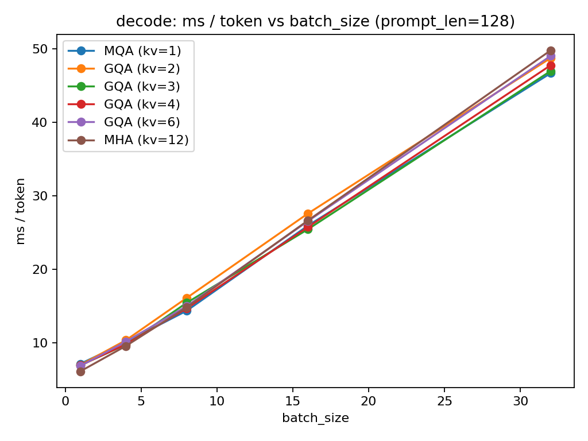

### Prompt Length = 512
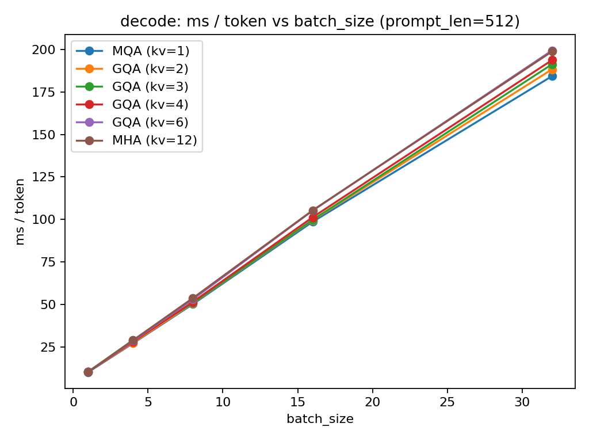

### Prompt Length = 1024
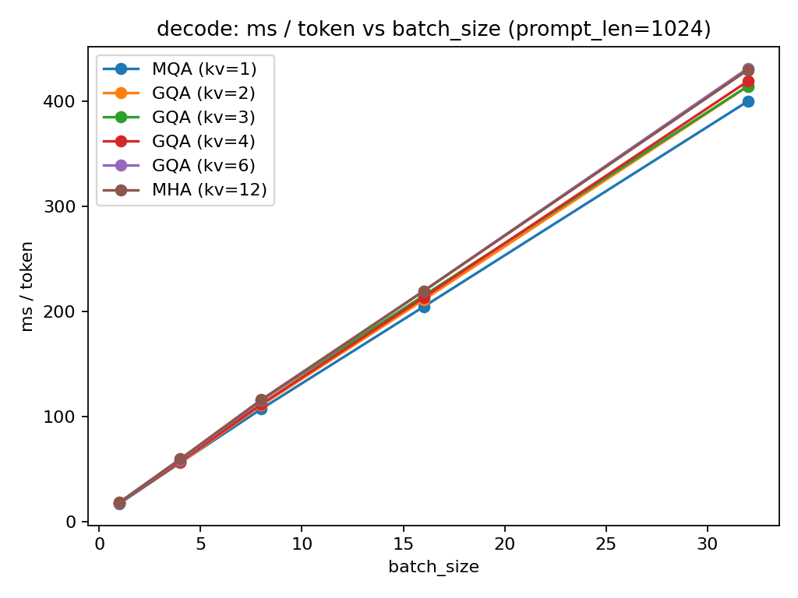

### Prompt Length = 2048
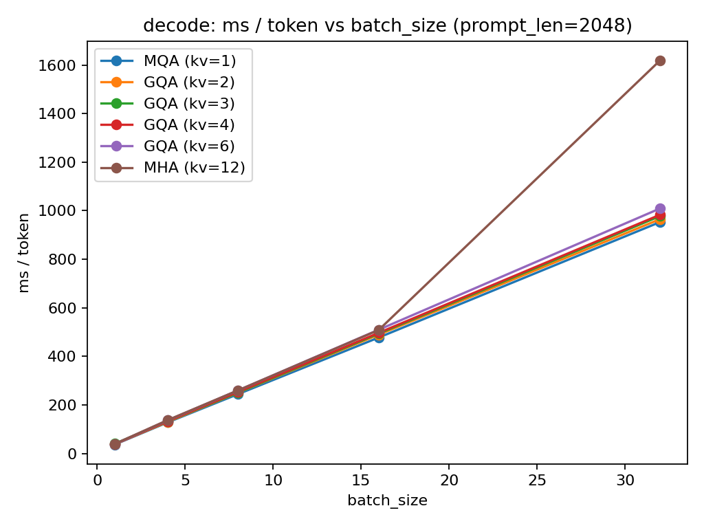

---

## 3. Decode Peak Memory vs Prompt Length

### Batch = 1

### Batch = 4
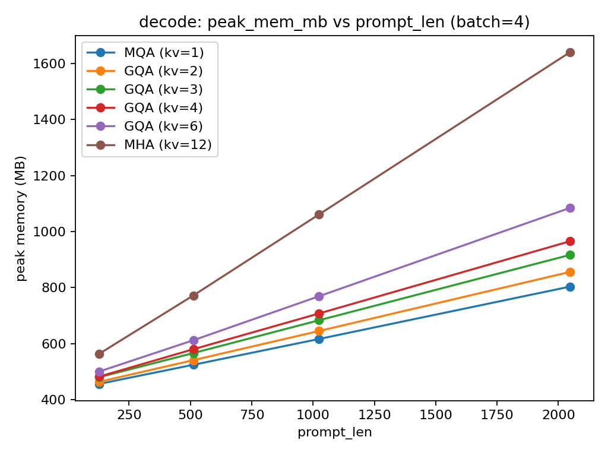

### Batch = 8
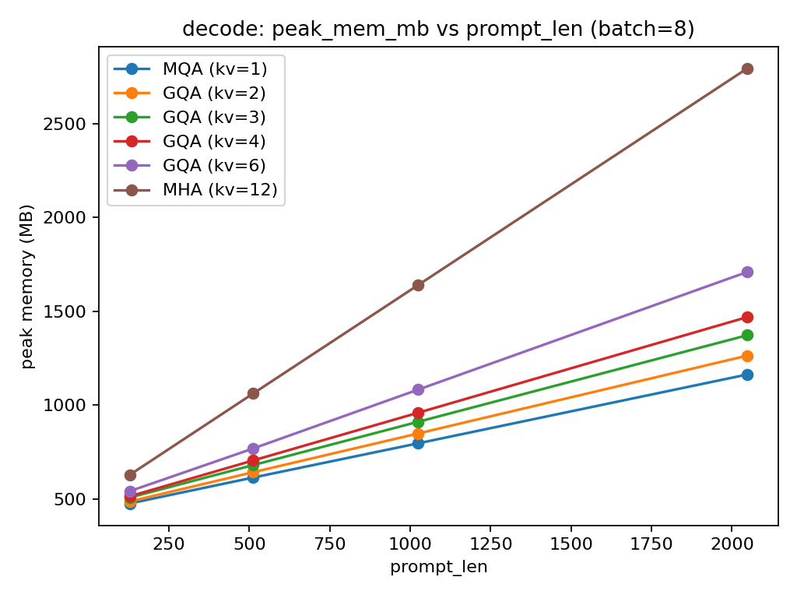

### Batch = 16

### Batch = 32
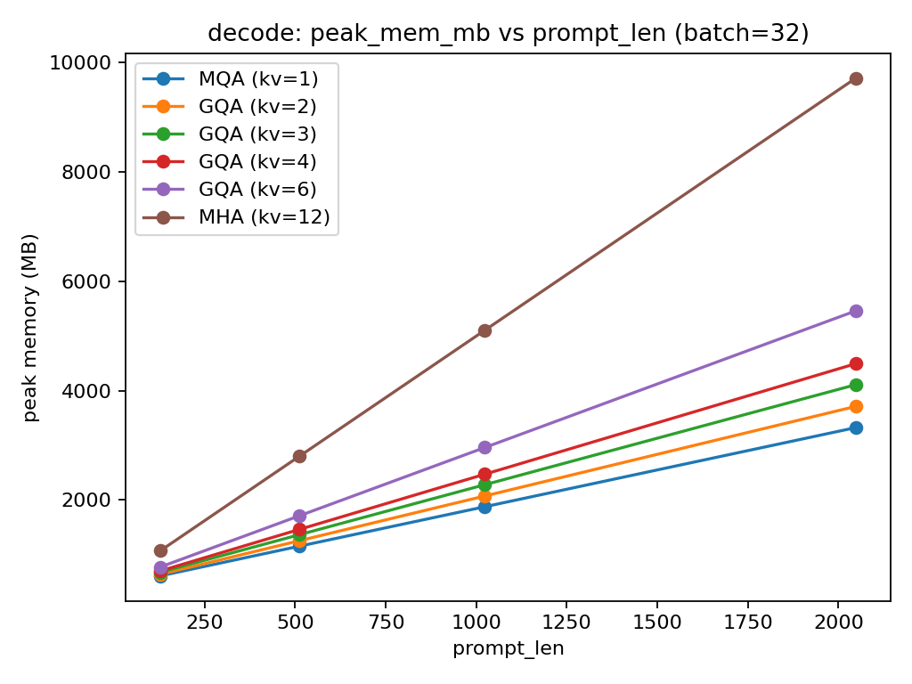

---

## 4. Validation Loss vs KV Heads

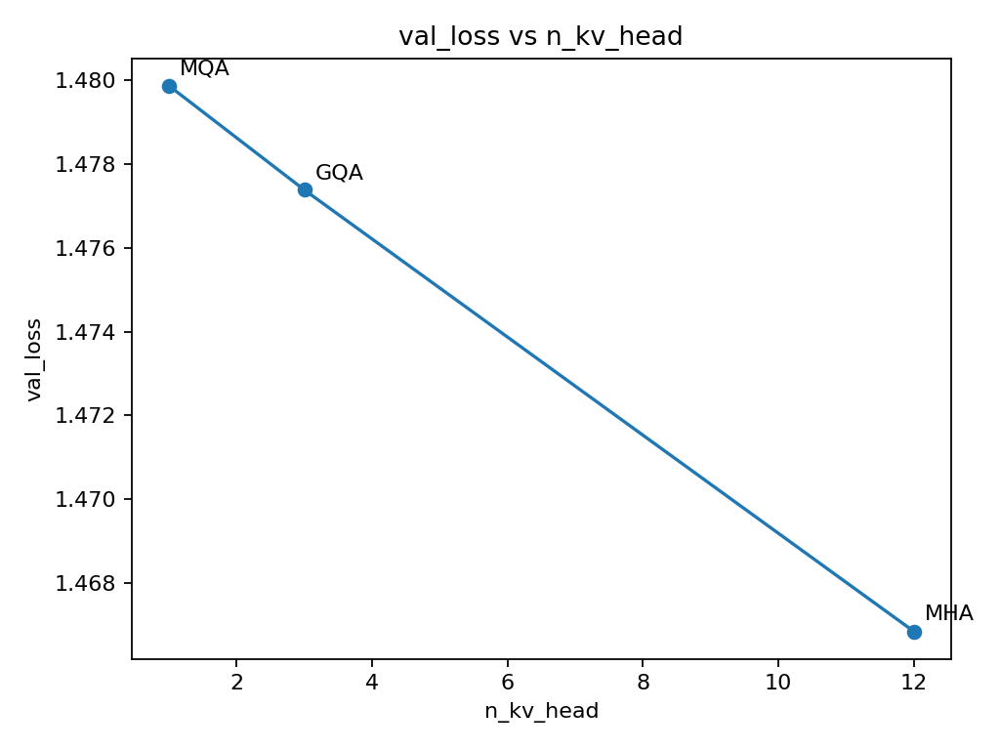

---

## 5. Validation Perplexity vs KV Heads

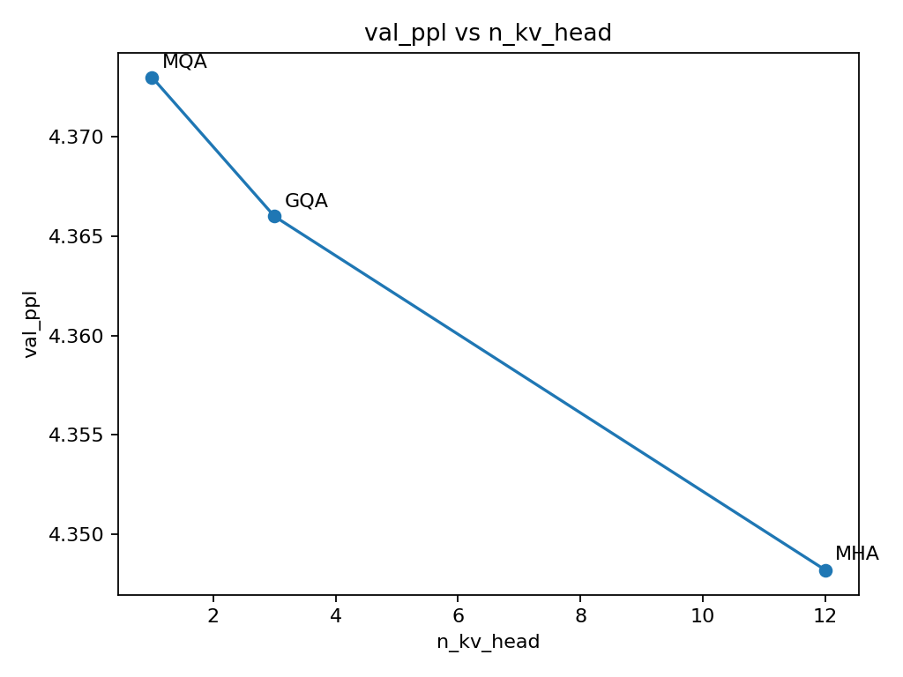

---

## 6. Conclusion

Grouped-Query Attention (GQA) sits on the Pareto frontier for inference:
- Near-MHA quality
- Much lower KV-cache memory
- Better decode throughput

This explains why modern inference engines default to GQA over classical MHA.
